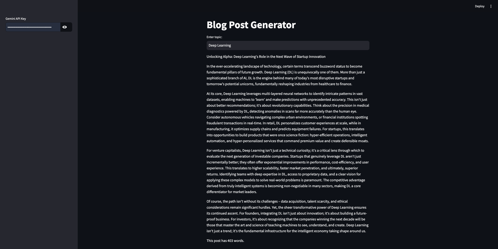
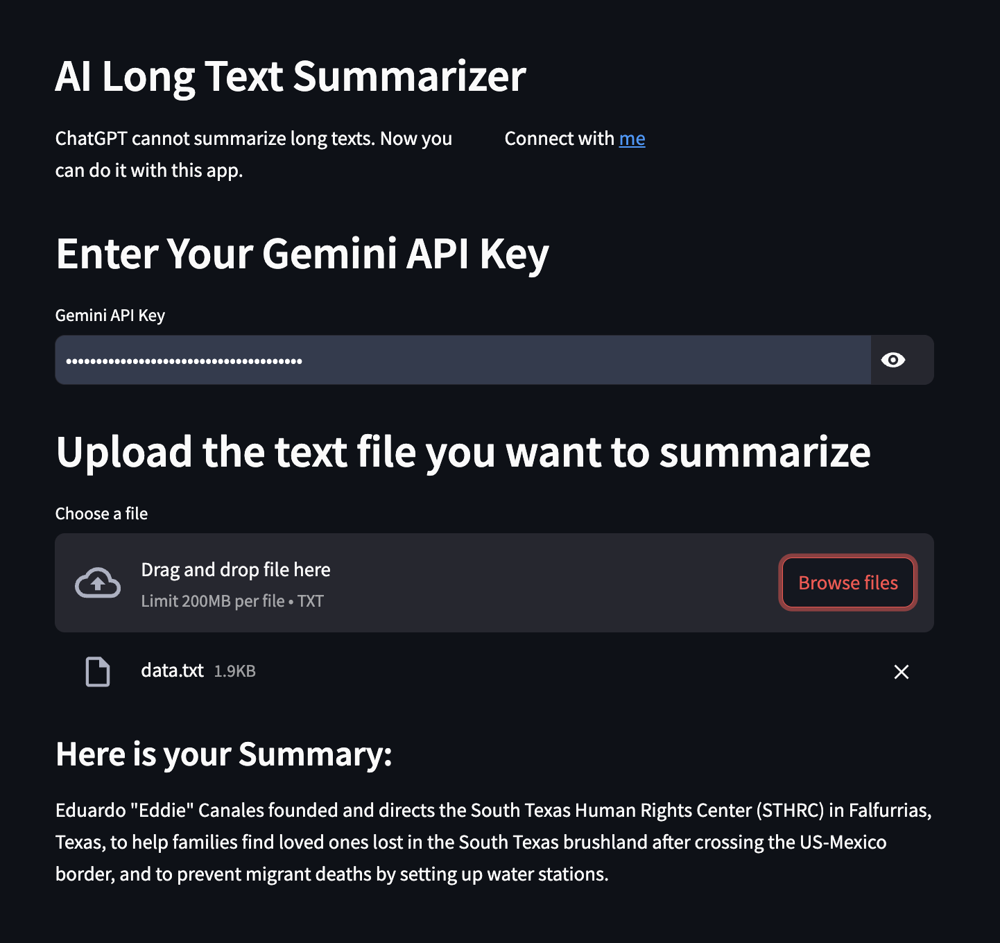

# LangChain Level 2 Application Development

This repository contains a collection of Streamlit web applications built using the LangChain framework, demonstrating various functionalities of Large Language Models (LLMs) with a focus on Google's Gemini model. These applications are designed to be beginner-friendly, providing practical examples of how to integrate LLMs into interactive web interfaces.

## Features

This project includes five distinct Streamlit applications, each showcasing a different aspect of LLM capabilities:

1.  **Streamlit Redaction Improver**: Re-writes text with specified tone and dialect.
2.  **Streamlit Blog Post Generator**: Generates blog posts on a given topic.
3.  **Streamlit Split and Summarize**: Summarizes long texts by splitting them into manageable chunks.
4.  **Streamlit Text Summarization**: Provides a concise summary of input text.
5.  **Streamlit Extract JSON from Review**: Extracts key information (sentiment, delivery days, price perception) from product reviews.

## Project Structure

The repository is organized into several folders, with each Streamlit application residing in its own dedicated directory:

```
.
├── 01-streamlit-redaction-improver/
│   ├── main.py
│   ├── README.md
│   └── requirements.txt
├── 02-streamlit-blog-post-generator/
│   ├── main.py
│   ├── README.md
│   └── requirements.txt
├── 03-streamlit-split-and-summarize/
│   ├── data.txt
│   ├── main.py
│   ├── README.md
│   └── requirements.txt
├── 04-streamlit-text-summarization/
│   ├── main.py
│   ├── README.md
│   └── requirements.txt
├── 05-streamlit-extract-json-from-review/
│   ├── main.py
│   ├── README.md
│   └── requirements.txt
├── Streamlit-Web-Apps-Images/
│   ├── 01.png
│   ├── 02.png
│   ├── 03.png
│   ├── 04.png
│   └── 05.png
└── README.md
```

## Installation

To get started with these applications, follow these steps:

1.  **Clone the repository**:

    ```bash
    git clone https://github.com/ranak8811/LangChain-Level-2-Application-Development.git
    cd LangChain-Level-2-Application-Development
    ```

2.  **Create a virtual environment** (recommended):

    ```bash
    python3.11 -m venv venv
    source venv/bin/activate  # On Windows, use `venv\Scripts\activate`
    ```

3.  **Install dependencies for each application**:
    Each application has its own `requirements.txt` file. You need to install the dependencies for each application you wish to run.

    For example, to install dependencies for the "Streamlit Redaction Improver":

    ```bash
    cd 01-streamlit-redaction-improver
    pip install -r requirements.txt
    cd ..
    ```

    Repeat this for each application folder (`02-streamlit-blog-post-generator`, `03-streamlit-split-and-summarize`, `04-streamlit-text-summarization`, `05-streamlit-extract-json-from-review`).

    **Common Libraries Used Across Applications**:

    - `streamlit`: For building interactive web applications.
    - `langchain`: The core framework for developing applications with LLMs.
    - `langchain-google-generativeai`: For integrating with Google's Gemini models.
    - `langchain-core`: Core abstractions for LangChain.
    - `langchain-text-splitters`: For splitting text into manageable chunks.
    - `pandas`: (Used in some apps) For data manipulation.
    - `tiktoken`: (Used in some apps, primarily for OpenAI token counting, but might be present)

## Usage

To run any of the Streamlit applications, navigate into its respective directory and execute the `streamlit run` command.

**Important**: Most applications require a Gemini API Key. You can obtain one from [Google AI Studio](https://ai.google.dev/gemini-api/docs/get-started/python).

### Running an Application Example:

To run the "Streamlit Redaction Improver" app:

```bash
cd 01-streamlit-redaction-improver
streamlit run main.py
```

This will open the application in your web browser.

## Applications Overview

Here's a detailed look at each application:

### 1. Streamlit Redaction Improver

This application allows you to re-write a draft text by specifying a desired tone (Formal or Informal) and an English dialect (American or British). It's useful for refining communication to suit different audiences.

**How to Use**:

1.  Enter your Gemini API Key in the sidebar.
2.  Type or paste your draft text into the provided text area.
3.  Select your desired tone and English dialect from the dropdown menus.
4.  The re-written text will appear in the "Your Re-written text:" section.

**Screenshot**:


### 2. Streamlit Blog Post Generator

This app leverages the Gemini model to generate a 400-word blog post on any given topic. It's designed to assist content creators in quickly drafting articles.

**How to Use**:

1.  Enter your Gemini API Key in the sidebar.
2.  Type the topic for your blog post in the "Enter topic:" field.
3.  The generated blog post, along with its word count, will be displayed.

**Screenshot**:


### 3. Streamlit Split and Summarize

Designed for handling long texts, this application first splits the input text into smaller, manageable chunks and then summarizes them using the Gemini model. This is ideal for summarizing lengthy documents or articles that exceed typical LLM input limits.

**How to Use**:

1.  Enter your Gemini API Key in the sidebar.
2.  Upload a text file (`.txt`) containing the long text you wish to summarize.
3.  The summarized output will appear in the "Here is your Summary:" section.

**Screenshot**:


### 4. Streamlit Text Summarization

A straightforward application for summarizing any given text. Simply input your text, and the app will provide a concise summary.

**How to Use**:

1.  Enter your Gemini API Key in the text input field.
2.  Type or paste your text into the "Enter your text" area.
3.  Click "Submit" to get the summarized output.

**Screenshot**:


### 5. Streamlit Extract JSON from Review

This application is designed to extract specific key information from product reviews, such as sentiment (Positive, Negative, Neutral, Unknown), delivery days, and price perception (Expensive, Cheap, Neutral, Unknown). The extracted data is presented in a structured bullet-point format.

**How to Use**:

1.  Enter your Gemini API Key in the text input field.
2.  Type or paste the product review into the "Enter the product review" area.
3.  The extracted key data will be displayed in the "Key Data Extracted:" section.

**Screenshot**:


## Contributing

Feel free to fork this repository, submit pull requests, or open issues if you find any bugs or have suggestions for improvements.

## License

This project is open-source and available under the MIT License.
